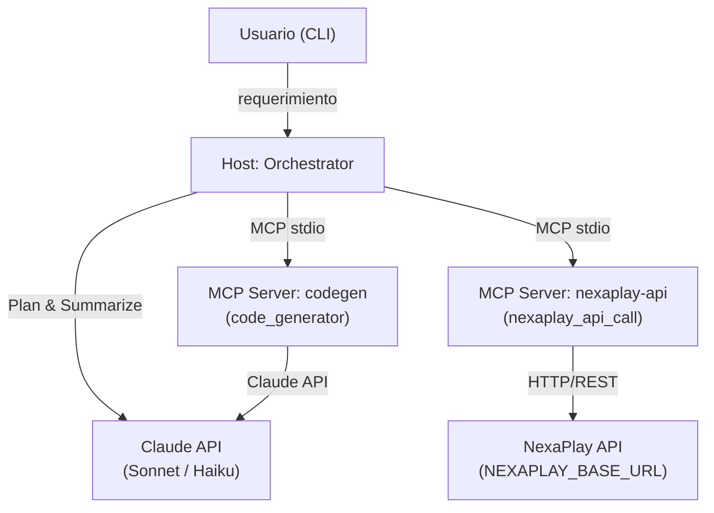

# NexaPlay Agent — Agente AI-Native

Agente conversacional que traduce requerimientos en lenguaje natural en llamadas reales a la API de NexaPlay, generando código e informes de ejecución con confirmación humana para escrituras.

## Arquitectura

El agente sigue un ciclo **Plan → ReAct → Validación → Resumen**: primero genera un plan estructurado de pasos desde el requerimiento del usuario (usando Claude Sonnet), luego ejecuta cada paso invocando herramientas vía MCP, y al finalizar produce un resumen en lenguaje natural usando Claude Haiku. Cada tarea de Claude (planificación, razonamiento, generación de código, resumen) usa el modelo y temperatura óptimos para ese trabajo, configurables por variable de entorno.

La comunicación entre el proceso host y los dos servidores de habilidades ocurre por **MCP stdio**: el host lanza subprocesos y se comunica con ellos por stdin/stdout usando el protocolo MCP. Esto aísla las habilidades del proceso principal y permite escalar o reemplazarlas de forma independiente. Para detalle de cada decisión, ver el [ADR](specs/nexaplay-openapi.yaml) y la sección [Decisiones de arquitectura clave](#decisiones-de-arquitectura-clave).



## Instalación

```bash
# 1. Clonar el repositorio
git clone <repo-url>
cd nexaplay-agent

# 2. Crear y activar entorno virtual
python -m venv .venv
# Linux / macOS:
source .venv/bin/activate
# Windows PowerShell:
.venv\Scripts\Activate.ps1

# 3. Instalar dependencias (incluyendo dev)
pip install -e ".[dev]"

# 4. Configurar variables de entorno
cp .env.example .env
# Editar .env con tus claves (ver sección Configuración)
```

## Configuración

Variables requeridas en `.env`:

| Variable | Descripción | Dónde obtenerla |
|---|---|---|
| `ANTHROPIC_API_KEY` | Clave de API de Anthropic | [console.anthropic.com](https://console.anthropic.com) |
| `NEXAPLAY_BASE_URL` | URL base de la API de NexaPlay (ej: `https://api.nexaplay.io`) | Equipo de infraestructura NexaPlay |

Variables opcionales con sus valores por defecto:

| Variable | Default | Descripción |
|---|---|---|
| `LOG_LEVEL` | `INFO` | Nivel de logging (`DEBUG`, `INFO`, `WARNING`, `ERROR`) |
| `MAX_ITERATIONS` | `15` | Máximo de pasos que el agente ejecutará por job |
| `MAX_RETRIES` | `3` | Reintentos automáticos en errores 5xx y de red |
| `REQUEST_TIMEOUT_SEC` | `5` | Timeout por llamada HTTP a NexaPlay |
| `MODEL_PLANNING` | `claude-sonnet-4-5` | Modelo Claude para planificación |
| `MODEL_REASONING` | `claude-sonnet-4-5` | Modelo Claude para razonamiento |
| `MODEL_CODEGEN` | `claude-sonnet-4-5` | Modelo Claude para generación de código |
| `MODEL_SUMMARIZATION` | `claude-haiku-4-5-20251001` | Modelo Claude para resúmenes |

> **Nota sobre versión de modelos:** La prueba técnica original especificaba el uso de modelos Claude 4 (ej. `claude-sonnet-4-20250514`). Sin embargo, Anthropic deprecó esa generación de modelos poco después de publicarse el enunciado, por lo que se migraron los defaults a **Claude 4.5** (`claude-sonnet-4-5`, `claude-haiku-4-5-20251001`), que son los sucesores directos y funcionalmente equivalentes. Las variables de entorno `MODEL_*` permiten apuntar a cualquier versión si se requiere reproducir el comportamiento exacto de la prueba.

## Uso

```bash
python -m src.agent.cli "Necesito un módulo que consulte el límite operacional del servicio 42 para el operador MX-01"
```

Flags disponibles:

```
--dry-run    Simula POSTs sin ejecutarlos (útil para validar planes antes de escribir)
--verbose    Activa logs de debug del MCP client y del agente
```

**Qué ocurre al ejecutar:**

1. **Plan**: el agente analiza el requerimiento y genera una secuencia ordenada de pasos con precondiciones y referencias entre pasos.
2. **Ejecución ReAct**: cada paso invoca una herramienta MCP; si el paso es un POST, se solicita confirmación explícita al usuario antes de proceder.
3. **Resumen**: al concluir, Claude Haiku produce un resumen del job con status, pasos ejecutados y artefactos generados.

Los artefactos de código generados se escriben en `workspace/<job_id>/`.

## Tests

```bash
pytest
```

La suite cubre:

- **Por skill**: tests unitarios de cada MCP server invocando directamente el handler de herramienta (`test_nexaplay_mcp_server.py`, `test_codegen.py`).
- **HTTP client**: tests del cliente HTTP con mocks de respuesta via `respx` (`test_http_client.py`).
- **Orchestrator**: tests de integración del ciclo completo con mocks de MCP hub y cliente Anthropic (`test_orchestrator.py`).
- **Componentes internos**: planner (`test_planner.py`), validador (`test_validator.py`), model router (`test_model_router.py`), context manager (`test_context_manager.py`), MCPHub (`test_mcp_hub.py`).

## Estructura del proyecto

```
nexaplay-agent/
├── specs/
│   └── nexaplay-openapi.yaml    # Contrato OpenAPI de la API de NexaPlay (fuente de verdad)
├── src/
│   ├── agent/
│   │   ├── cli.py               # Entry-point CLI; RichOrchestrator con UI via rich
│   │   ├── orchestrator.py      # Ciclo Plan → ReAct → Validación → Resumen
│   │   ├── planner.py           # Generación y evaluación de planes estructurados
│   │   ├── context_manager.py   # Ventana deslizante de observaciones con summarización
│   │   ├── model_router.py      # Selección de modelo Claude por tipo de tarea
│   │   ├── mcp_client.py        # MCPHub: gestión de conexiones MCP stdio
│   │   ├── validator.py         # Validaciones de seguridad (paths, SILENT_WRITE_FAILURE)
│   │   └── prompts/             # Templates de prompts (system, planner, codegen, summarizer)
│   ├── skills/
│   │   ├── nexaplay_api/
│   │   │   ├── server.py        # MCP server: expone nexaplay_api_call y el OpenAPI spec
│   │   │   └── http_client.py   # Cliente HTTP con retry, backoff e idempotency-key
│   │   └── codegen/
│   │       ├── server.py        # MCP server: expone code_generator y guía de estilo
│   │       └── generator.py     # Generación de código + test via Claude
│   └── tests/                   # Suite de tests (pytest-asyncio)
├── workspace/                   # Artefactos generados por job (creado en runtime)
├── pyproject.toml
└── .env.example
```

## Skills MCP

| Nombre | Descripción | Inputs requeridos | Outputs | Errores posibles |
|---|---|---|---|---|
| `nexaplay_api_call` | Llamada HTTP (GET/POST) a NexaPlay con retry automático e idempotency-key determinística | `endpoint`, `method`, `job_id`, `step`; opcionales: `params`, `body` | `{"success": true, "data": {...}}` | `VALIDATION_ERROR` (4xx, no reintenta), `SERVER_ERROR` (5xx, reintenta ×3), `NETWORK_ERROR`, `TIMEOUT_ERROR`, `SILENT_WRITE_FAILURE` (2xx pero cambio no aplicado) |
| `code_generator` | Genera código funcional con test unitario basándose exclusivamente en `technical_context` | `requirement`, `technical_context`; opcional: `language` (`python`\|`typescript`) | `{"success": true, "code": "...", "test": "...", "filename": "..."}` | `MISSING_ARGUMENT`, error de generación de Claude |

**Recurso MCP adicional:**
- `nexaplay://openapi-spec` — spec OpenAPI completo de NexaPlay (YAML), accesible por el agente para consulta.
- `codegen://style-guide` — convenciones de idioma y librerías para generación de código.

## Decisiones de arquitectura clave

- **Híbrido ReAct + Plan & Execute**: el agente no reacciona paso a paso en crudo (ReAct puro), sino que primero genera un plan completo con precondiciones y referencias entre pasos (`$stepN.field`), lo que reduce tokens consumidos y permite detectar loops antes de ejecutar.
- **MCP stdio sobre HTTP local**: los servidores de habilidades se lanzan como subprocesos y se comunican por stdin/stdout. Elimina la necesidad de puertos, autenticación y descubrimiento de servicios para la capa de habilidades.
- **Idempotency-Key determinística**: cada POST calcula su clave como `sha256(job_id + ":" + step_id)`, lo que garantiza exactamente una escritura ante reintentos de red sin requerir estado distribuido.
- **Ventana deslizante de contexto**: el `ContextManager` mantiene solo las últimas N observaciones en ventana activa; las más antiguas se comprimen automáticamente a una frase via Claude Haiku antes de descartarse, manteniendo el costo de tokens acotado en jobs largos.
- **Confirmación humana para escrituras**: todo POST requiere que el usuario escriba `confirmar` explícitamente en CLI antes de ejecutarse. Esto es un control de seguridad no bypasseable en el flujo normal.

## Demo

Ver [DEMO_LINK.md](DEMO_LINK.md).

## Limitaciones conocidas

- **Confirmación manual requerida para todo POST**: el agente no puede ejecutar escrituras de forma autónoma; cada POST interrumpe el flujo esperando confirmación del usuario en terminal.
- **Sin soporte para `/events/stream`**: endpoints de streaming de la API de NexaPlay no están implementados en esta versión; solo se procesan respuestas JSON síncronas.
- **Máximo 15 iteraciones por job**: jobs que requieran más pasos se abortan con status `aborted`; el límite es configurable vía `MAX_ITERATIONS` pero el agente no hace rollback de pasos ya ejecutados.
- **Un solo operador por job**: el planner no está diseñado para fanout a múltiples operadores en paralelo; trabajar con N operadores requiere N invocaciones separadas del CLI.

## Licencia

MIT
